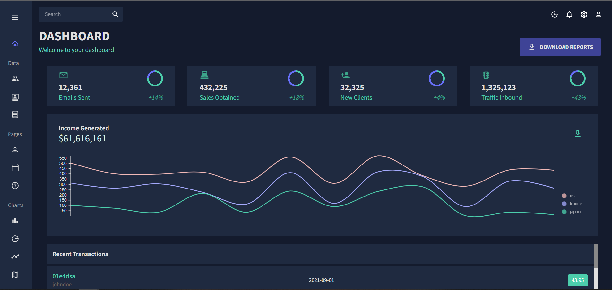

# Admin Dashboard 🗃

## Table of contents

- [Summary](#summary)
- [Screenshot](#screenshot)
- [Link](#link)
- [Built with](#built-with)
- [Utility Links](#utility-links)

## Summary

> **I've created an admin dashboard. The aim of the project is that displaying data in meaningful way thanks to tables, charts, progress bars and calendars, so teams can manage their data in efficient way. Dynamic tables shows us information of employees and customers, we can determine incomes, expenses and also take a look at inbound traffic on our website by considering charts. Adding and removing tasks can be done on calendar app, so we can have task-management system for business actions.**

- I have worked with JavaScript, React.js, MaterialUI, Nivo Charts, Full Calendar technologies to create this good-looking fully-responsive interactive page 🎯.
- I've used the advantages of React.js to manipulate the DOM efficiently 🎢.
- I like working with MaterialUI to handle design of the pages. Also using mui-tables, mui-DataGrid system, mui-theme hooks take the project to the next level ✨.
- Displaying data in charts provides us better consideration for developing our business, and Nivo Charts do this job effectively. Also documentation of the Nivo is powerful to create various of charts 📊🍰🌐.
- Functionality of FullCalendar package makes us stronger to manage duties on a team 📅.

  > **What's next?**
  > Integrating backend service for the app, so creating new employees and customers can be done. Also we can fetch data that comes from api. (I consider Django to create backend 🐍)

## Link

<a href="https://business-dashboard-project.vercel.app/">Live Version of the project</a>

## Screenshot

## Built with

- JavaScript
- React.js
- MaterialUI
- Nivo Charts
- FullCalendar

## Utility Links

> [JavaScript](https://developer.mozilla.org/en-US/docs/Web/JavaScript)  
> [React.js](https://beta.reactjs.org/)  
> [MaterialUI](https://mui.com/material-ui/getting-started/overview/)  
> [Nivo Charts](https://nivo.rocks/)  
> [Full Calendar](https://fullcalendar.io/docs/initialize-es6)  
> [react-pro-sidebar](https://www.npmjs.com/package/react-pro-sidebar)  
> [Formik](https://formik.org/docs/guides/validation)  
> [Yup](https://www.npmjs.com/package/yup)

 Keep Building 🚀

